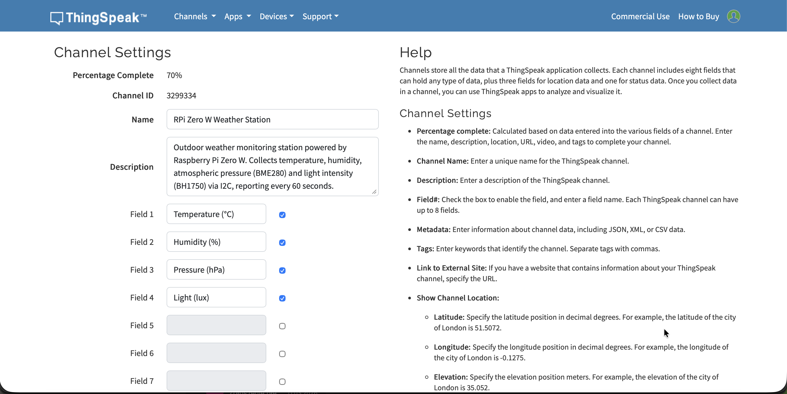

# Sprawozdanie — Stacja Pogodowa na Raspberry Pi Zero W

**Przedmiot:** SCIR
**Autorzy:** Oliwier Szypczyn, Kacper Multan
**Data rozpoczęcia:** 2026-03-13

---

## Spis treści

1. [Krok 1 — Konfiguracja ThingSpeak](#krok-1--konfiguracja-thingspeak)
2. [Krok 2 — Instalacja systemu na karcie microSD](#krok-2--instalacja-systemu-na-karcie-microsd)
3. [Krok 3 — Pierwsze uruchomienie Pi i połączenie SSH](#krok-3--pierwsze-uruchomienie-pi-i-połączenie-ssh)
4. [Krok 4 — Konfiguracja Pi (I2C, aktualizacja)](#krok-4--konfiguracja-pi-i2c-aktualizacja)
5. [Krok 5 — Fizyczne podłączenie czujników](#krok-5--fizyczne-podłączenie-czujników)
6. [Krok 6 — Weryfikacja czujników i biblioteki](#krok-6--weryfikacja-czujników-i-biblioteki)
7. [Krok 7 — Skrypt stacji pogodowej](#krok-7--skrypt-stacji-pogodowej)
8. [Krok 8 — Weryfikacja danych w ThingSpeak](#krok-8--weryfikacja-danych-w-thingspeak)
9. [Krok 9 — Automatyzacja (cron)](#krok-9--automatyzacja-cron)

---

## Krok 1 — Konfiguracja ThingSpeak

**Cel:** Założenie konta MathWorks, utworzenie kanału ThingSpeak i pozyskanie klucza API potrzebnego do wysyłania danych z czujników.

### 1.1 Rejestracja konta MathWorks

Utworzono konto studenckie MathWorks na stronie https://www.mathworks.com/mwaccount/register, podając uczelniany adres e-mail.

### 1.2 Utworzenie kanału ThingSpeak

Po zalogowaniu na https://thingspeak.com przejśto do **Channels → New Channel** i wypełniono formularz:

| Pole | Wartość |
|------|---------|
| **Channel Name** | `RPi Zero W Weather Station` |
| **Description** | `Outdoor weather monitoring station powered by Raspberry Pi Zero W. Collects temperature, humidity, atmospheric pressure (BME280) and light intensity (BH1750) via I2C, reporting every 60 seconds.` |
| **Field 1** | `Temperature (°C)` |
| **Field 2** | `Humidity (%)` |
| **Field 3** | `Pressure (hPa)` |
| **Field 4** | `Light (lux)` |
| **Metadata** | `{"sensors":["BME280","BH1750"],"board":"Raspberry Pi Zero WH","protocol":"I2C","interval_s":60}` |
| **Tags** | `raspberry pi, weather station, bme280, bh1750, iot, i2c, warsaw` |
| **Latitude** | `52.2220` |
| **Longitude** | `21.0070` |
| **Elevation** | `112` |

### 1.3 Widok utworzonego kanału

Po zapisaniu kanału ThingSpeak wygenerował pustą stronę z czterema wykresami (po jednym na każde pole). Wykresy zaczną pokazywać dane po uruchomieniu skryptu na Raspberry Pi.

### 1.4 Pozyskanie klucza API

W zakładce **API Keys** skopiowano **Write API Key**, który jest niezbędny do autoryzacji zapytań HTTP POST wysyłanych z Raspberry Pi. Klucz zapisano w pliku `.env` w repozytorium projektu (plik dodany do `.gitignore`, aby nie trafił do publicznego repozytorium).

---

<!-- Dalsze kroki będą uzupełniane w miarę realizacji projektu -->
