- **Przedmiot:** SCIR
- **Autorzy:** Oliwier Szypczyn, Kacper Multan
- **Data rozpoczęcia:** 2026-03-13

---

## Spis treści

- [Spis treści](#spis-treści)
- [Opis projektu](#opis-projektu)
- [Komponenty](#komponenty)
- [Architektura systemu](#architektura-systemu)
- [Schemat połączeń](#schemat-połączeń)
- [Krok 1 — Konfiguracja ThingSpeak](#krok-1--konfiguracja-thingspeak)
  - [1.1 Rejestracja konta MathWorks](#11-rejestracja-konta-mathworks)
  - [1.2 Utworzenie kanału ThingSpeak](#12-utworzenie-kanału-thingspeak)
  - [1.3 Widok utworzonego kanału](#13-widok-utworzonego-kanału)
  - [1.4 Pozyskanie klucza API](#14-pozyskanie-klucza-api)
- [Krok 2 — Instalacja systemu na karcie microSD](#krok-2--instalacja-systemu-na-karcie-microsd)
  - [2.1 Pobranie Raspberry Pi Imager](#21-pobranie-raspberry-pi-imager)
  - [2.2 Wybór systemu operacyjnego](#22-wybór-systemu-operacyjnego)
  - [2.3 Wybór karty microSD](#23-wybór-karty-microsd)
  - [2.4 Konfiguracja wstępna (OS Customisation)](#24-konfiguracja-wstępna-os-customisation)
  - [2.5 Zapis obrazu na kartę](#25-zapis-obrazu-na-kartę)
  - [2.6 Weryfikacja i zakończenie](#26-weryfikacja-i-zakończenie)
- [Krok 3 — Pierwsze uruchomienie Pi i połączenie SSH](#krok-3--pierwsze-uruchomienie-pi-i-połączenie-ssh)
  - [3.1 Włożenie karty i uruchomienie Pi](#31-włożenie-karty-i-uruchomienie-pi)
  - [3.2 Połączenie SSH z komputera](#32-połączenie-ssh-z-komputera)
- [Krok 4 — Konfiguracja Pi (I2C, aktualizacja)](#krok-4--konfiguracja-pi-i2c-aktualizacja)
  - [4.1 Aktualizacja systemu](#41-aktualizacja-systemu)
  - [4.2 Włączenie interfejsu I2C](#42-włączenie-interfejsu-i2c)
  - [4.3 Instalacja narzędzi I2C i bibliotek](#43-instalacja-narzędzi-i2c-i-bibliotek)
  - [4.4 Restart i weryfikacja](#44-restart-i-weryfikacja)
- [Krok 5 — Testowy skrypt Python (LED + I2C)](#krok-5--testowy-skrypt-python-led--i2c)
  - [5.1 Przesłanie skryptu na Pi](#51-przesłanie-skryptu-na-pi)
  - [5.2 Uruchomienie skryptu](#52-uruchomienie-skryptu)
  - [5.3 Wynik działania](#53-wynik-działania)
- [Krok 6 — Podłączenie czujników i weryfikacja I2C](#krok-6--podłączenie-czujników-i-weryfikacja-i2c)
  - [6.1 Podłączenie czujników na płytce stykowej](#61-podłączenie-czujników-na-płytce-stykowej)
  - [6.2 Weryfikacja połączeń — skan I2C](#62-weryfikacja-połączeń--skan-i2c)
  - [6.3 Instalacja bibliotek Python](#63-instalacja-bibliotek-python)
  - [6.4 Szybki test odczytu czujników](#64-szybki-test-odczytu-czujników)
- [Krok 7 — Skrypt główny stacji pogodowej](#krok-7--skrypt-główny-stacji-pogodowej)
  - [7.1 Utworzenie pliku `.env` z kluczem API](#71-utworzenie-pliku-env-z-kluczem-api)
  - [7.2 Utworzenie skryptu `weather_station.py`](#72-utworzenie-skryptu-weather_stationpy)
  - [7.3 Instalacja dodatkowej zależności](#73-instalacja-dodatkowej-zależności)
  - [7.4 Uruchomienie testowe](#74-uruchomienie-testowe)
- [Krok 8 — Usługa systemd (automatyczny start)](#krok-8--usługa-systemd-automatyczny-start)
  - [8.1 Utworzenie pliku usługi](#81-utworzenie-pliku-usługi)
  - [8.2 Instalacja i aktywacja usługi](#82-instalacja-i-aktywacja-usługi)
  - [8.3 Weryfikacja działania](#83-weryfikacja-działania)

---

## Opis projektu

Celem projektu jest budowa stacji pogodowej opartej na mikrokomputerze **Raspberry Pi Zero W**. Stacja mierzy temperaturę, wilgotność powietrza, ciśnienie atmosferyczne oraz natężenie światła, a zebrane dane wysyła cyklicznie (co 60 sekund) do chmury **ThingSpeak**, gdzie prezentowane są jako wykresy w czasie rzeczywistym.

Komunikacja między mikrokomputerem a czujnikami odbywa się przez magistralę **I2C** (Inter-Integrated Circuit) — dwuprzewodowy protokół szeregowy, dzięki któremu oba czujniki współdzielą te same linie danych (SDA) i zegara (SCL), a rozróżniane są po unikatowych adresach. Dane z czujników przesyłane są do ThingSpeak za pomocą zapytań HTTP POST przez wbudowany moduł WiFi Raspberry Pi.

---

## Komponenty

| # | Komponent | Parametry | Rola w projekcie |
|---|-----------|-----------|------------------|
| 1 | **Raspberry Pi Zero WH** | ARM11 @ 1 GHz, 512 MB RAM, WiFi 802.11n, Bluetooth 4.1, 40-pin GPIO z wlutowanymi goldpinami | Jednostka centralna — odczytuje dane z czujników, przetwarza je i wysyła do chmury |
| 2 | **BME280** | Temperatura: −40…+85 °C (±1 °C), wilgotność: 0–100% (±3%), ciśnienie: 300–1100 hPa (±1 hPa), interfejs: I2C/SPI, zasilanie: 3,3 V, adres I2C: `0x76` | Czujnik temperatury, wilgotności i ciśnienia atmosferycznego |
| 3 | **BH1750** | Zakres: 1–65535 lx, rozdzielczość: 1 lx, interfejs: I2C, zasilanie: 3,3 V, adres I2C: `0x23` | Czujnik natężenia światła (iluminancji) |
| 4 | **Karta microSD Goodram 16 GB** | Class 10, UHS-I, 100 MB/s | Nośnik systemu operacyjnego (Raspberry Pi OS Lite) |
| 5 | **Płytka stykowa (breadboard)** | 400 otworów | Prototypowanie połączeń bez lutowania |
| 6 | **Kabelki jumper** | ~10 szt. | Połączenie pinów GPIO z czujnikami na płytce stykowej |
| 7 | **Zasilacz micro-USB 5 V / 2,5 A** | W zestawie z Pi | Zasilanie Raspberry Pi |

---

## Architektura systemu

**Przepływ danych:**

1. Czujniki BME280 i BH1750 podłączone do Raspberry Pi przez magistralę I2C
2. Skrypt Python (uruchamiany automatycznie przez cron) odczytuje dane co 60 sekund
3. Dane wysyłane zapytaniem HTTP POST do ThingSpeak REST API
4. ThingSpeak generuje wykresy dostępne przez przeglądarkę z dowolnego urządzenia

---

## Schemat połączeń

Oba czujniki komunikują się przez I2C i współdzielą te same 4 piny Raspberry Pi:

| Pin RPi | Funkcja | Kolor kabelka | Pin BME280 | Pin BH1750 |
|---------|---------|---------------|------------|------------|
| Pin 1 | 3,3 V | czerwony | VIN | VCC |
| Pin 6 | GND | czarny | GND | GND |
| Pin 3 | SDA (GPIO 2) | zielony | SDA | SDA |
| Pin 5 | SCL (GPIO 3) | żółty | SCL | SCL |

Łącznie podłączone są tylko **4 kabelki** z Raspberry Pi do płytki stykowej, na której umieszczone są oba czujniki. Rezystory pull-up nie są potrzebne — moduły BME280 i BH1750 mają je wbudowane. Rozróżnianie czujników na wspólnej magistrali odbywa się po adresach I2C (BME280: `0x76`, BH1750: `0x23`).

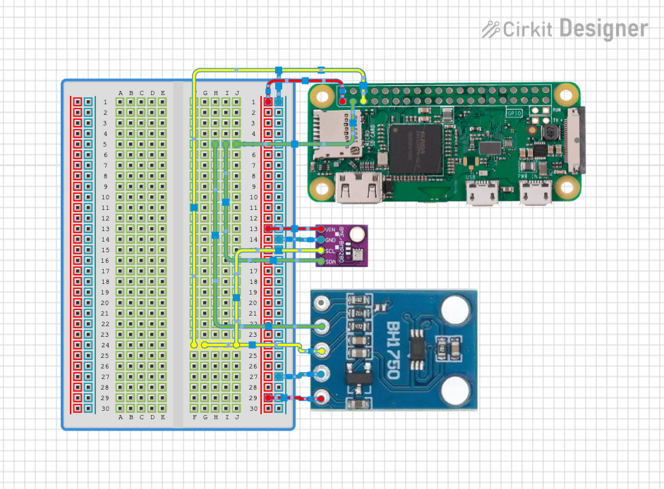

---

## Krok 1 — Konfiguracja ThingSpeak

**Cel:** Założenie konta MathWorks, utworzenie kanału ThingSpeak i pozyskanie klucza API potrzebnego do wysyłania danych z czujników.

### 1.1 Rejestracja konta MathWorks

Utworzono konto studenckie MathWorks na stronie https://www.mathworks.com/mwaccount/register, podając uczelniany adres e-mail.

### 1.2 Utworzenie kanału ThingSpeak

Po zalogowaniu na https://thingspeak.com przejśto do **Channels → New Channel** i wypełniono formularz:

| Pole | Wartość |
|------|---------|
| **Channel Name** | `RPi Zero W Weather Station` |
| **Description** | `Outdoor weather monitoring station powered by Raspberry Pi Zero W. Collects temperature, humidity, atmospheric pressure (BME280) and light intensity (BH1750) via I2C, reporting every 60 seconds.` |
| **Field 1** | `Temperature (°C)` |
| **Field 2** | `Humidity (%)` |
| **Field 3** | `Pressure (hPa)` |
| **Field 4** | `Light (lux)` |
| **Metadata** | `{"sensors":["BME280","BH1750"],"board":"Raspberry Pi Zero WH","protocol":"I2C","interval_s":60}` |
| **Tags** | `raspberry pi, weather station, bme280, bh1750, iot, i2c, warsaw` |
| **Latitude** | `52.2220` |
| **Longitude** | `21.0070` |
| **Elevation** | `112` |

### 1.3 Widok utworzonego kanału

Po zapisaniu kanału ThingSpeak wygenerował pustą stronę z czterema wykresami (po jednym na każde pole). Wykresy zaczną pokazywać dane po uruchomieniu skryptu na Raspberry Pi.

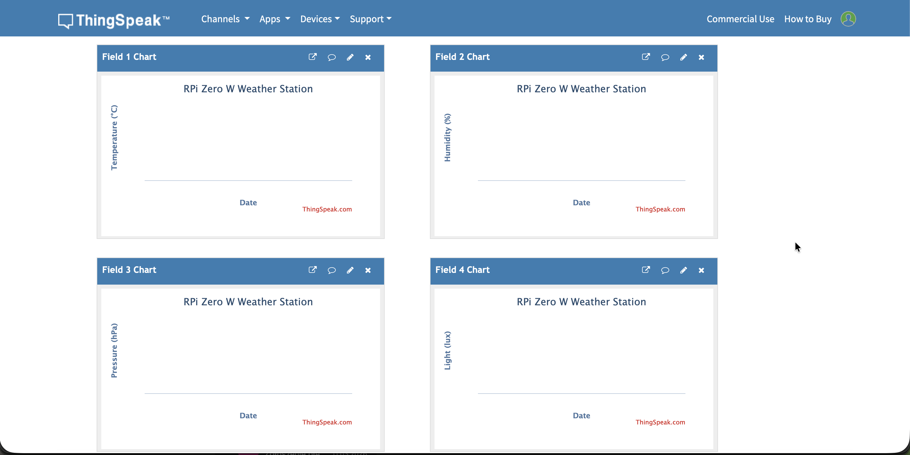

### 1.4 Pozyskanie klucza API

W zakładce **API Keys** skopiowano **Write API Key**, który jest niezbędny do autoryzacji zapytań HTTP POST wysyłanych z Raspberry Pi. Klucz zapisano w pliku `.env` w repozytorium projektu (plik dodany do `.gitignore`, aby nie trafił do publicznego repozytorium).

---

## Krok 2 — Instalacja systemu na karcie microSD

**Cel:** Wgranie systemu Raspberry Pi OS Lite na kartę microSD z wstępną konfiguracją SSH, WiFi i nazwy hosta — aby Pi po pierwszym uruchomieniu automatycznie połączyło się z siecią i było dostępne zdalnie.

### 2.1 Pobranie Raspberry Pi Imager

Pobrano i zainstalowano narzędzie **Raspberry Pi Imager** ze strony https://www.raspberrypi.com/software/. Imager pozwala na łatwe wgranie systemu operacyjnego na kartę microSD wraz z wstępną konfiguracją.

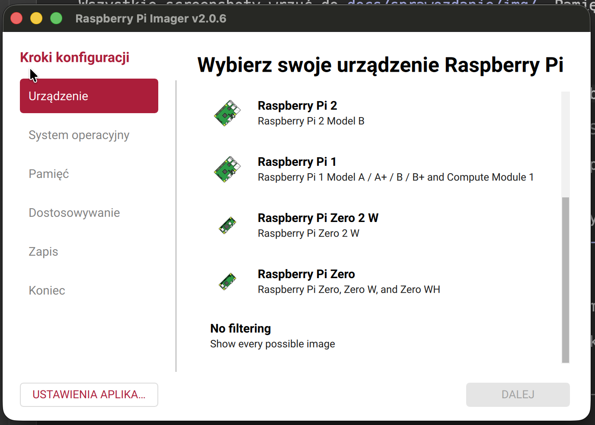

### 2.2 Wybór systemu operacyjnego

W Imager wybrano:
- **Device:** Raspberry Pi Zero W
- **System:** Raspberry Pi OS Lite (32-bit) — wersja bez środowiska graficznego, lżejsza i wystarczająca do pracy przez SSH (Pi Zero W ma procesor ARMv6, który nie obsługuje 64-bit)

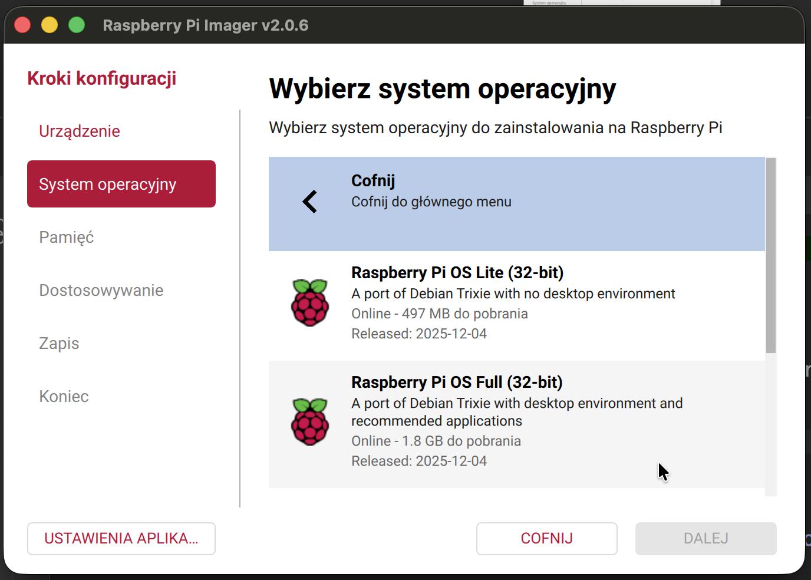

### 2.3 Wybór karty microSD

Włożono kartę microSD Goodram 16GB do komputera przez adapter i wybrano ją jako cel zapisu w Imager.

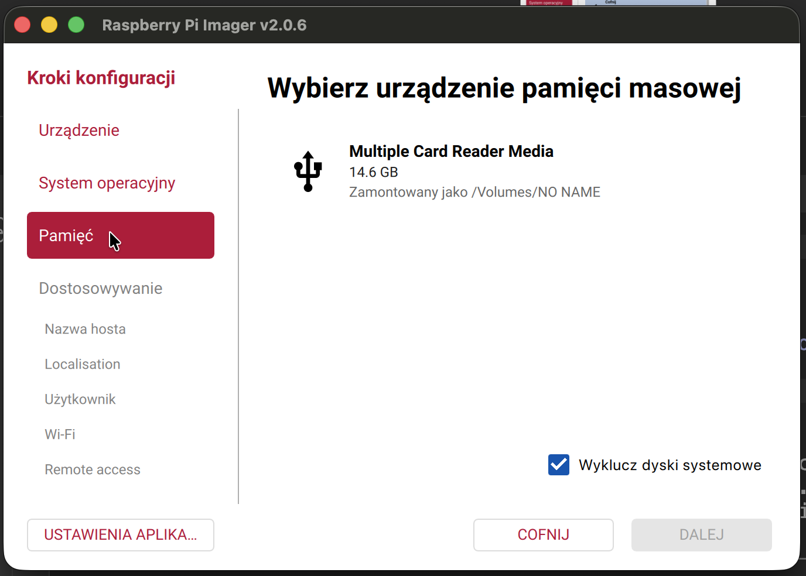

### 2.4 Konfiguracja wstępna (OS Customisation)

Przed zapisem kliknięto **Edit Settings** i skonfigurowano następujące parametry:

**Zakładka General:**

| Parametr | Wartość |
|----------|---------|
| **Hostname** | `weather-station` |
| **Username** | `pi` |
| **Password** | *(ustawione, ukryte ze względów bezpieczeństwa)* |
| **SSID WiFi** | *(nazwa domowej sieci WiFi)* |
| **Hasło WiFi** | *(ukryte)* |
| **Locale** | `Europe/Warsaw`, klawiatura `pl` |

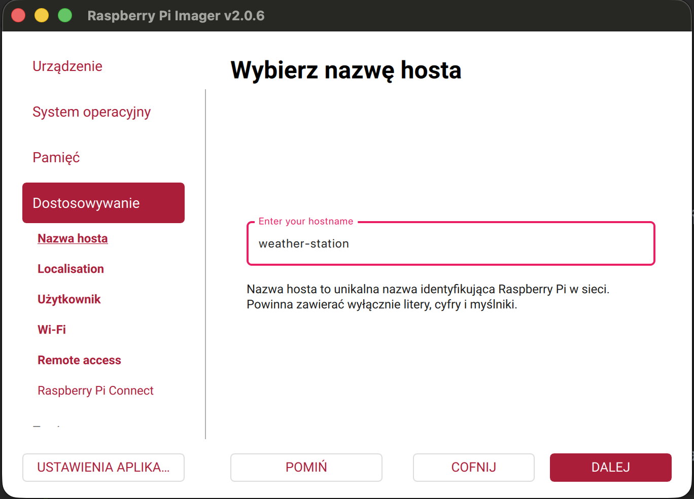

**Zakładka Services:**

Włączono **SSH** z uwierzytelnianiem hasłem — umożliwia zdalne połączenie z Pi od pierwszego uruchomienia.

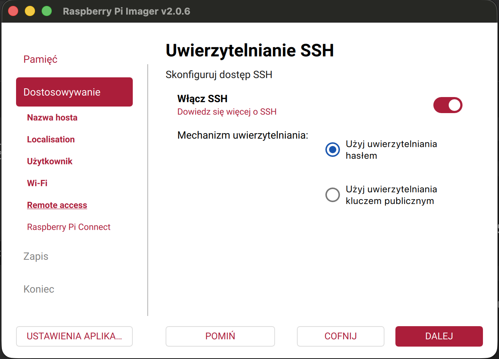

### 2.5 Zapis obrazu na kartę

Po zatwierdzeniu konfiguracji kliknięto **Zapisz** i rozpoczął się proces zapisu systemu na kartę microSD.

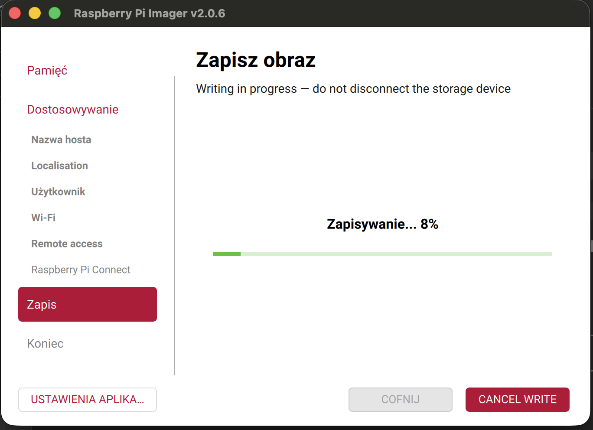

### 2.6 Weryfikacja i zakończenie

Imager automatycznie zweryfikował poprawność zapisu. Po wyświetleniu komunikatu o sukcesie bezpiecznie wyjęto kartę microSD z komputera.

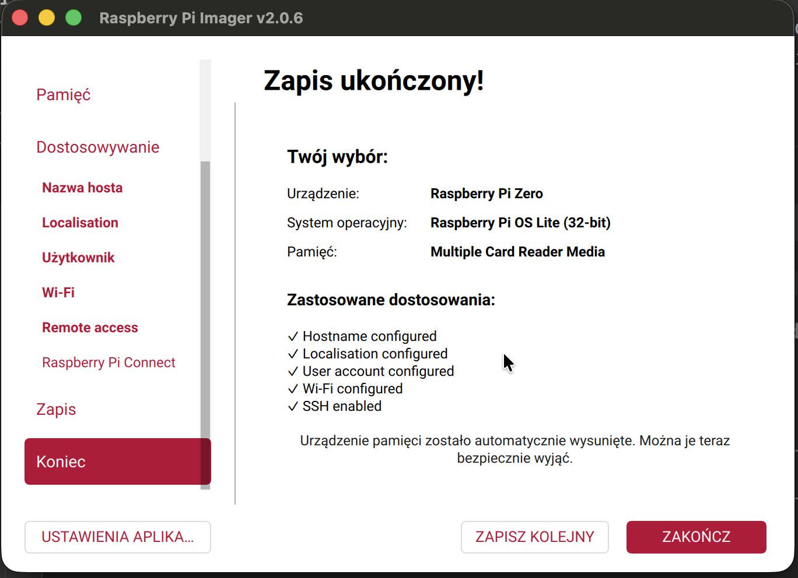

**Karta microSD jest gotowa do włożenia do Raspberry Pi Zero W** — system przy pierwszym uruchomieniu automatycznie połączy się z siecią WiFi i będzie dostępny przez SSH pod adresem `weather-station.local`.

---

## Krok 3 — Pierwsze uruchomienie Pi i połączenie SSH

**Cel:** Uruchomienie Raspberry Pi z przygotowaną kartą microSD, połączenie się z nim zdalnie przez SSH i potwierdzenie, że Pi jest dostępne w sieci.

### 3.1 Włożenie karty i uruchomienie Pi

Włożono kartę microSD do slotu w Raspberry Pi Zero WH i podłączono zasilacz micro-USB. Zielona dioda LED na płytce zaczęła migać, co oznacza odczyt z karty SD i uruchamianie systemu.


### 3.2 Połączenie SSH z komputera

Po odczekaniu ~2 minut (czas na boot i połączenie z WiFi) otworzono terminal na komputerze i połączono się z Pi:

```bash
ssh pi@weather-station.local
```

Przy pierwszym połączeniu terminal wyświetlił ostrzeżenie o nieznanym hoście (fingerprint). Wpisano `yes`, aby dodać Pi do listy znanych hostów, a następnie podano hasło ustawione w Imager. Po zalogowaniu wyświetlił się prompt systemowy Raspberry Pi OS, potwierdzając udane połączenie. Od tego momentu cała dalsza konfiguracja Pi odbywa się zdalnie przez SSH z komputera.

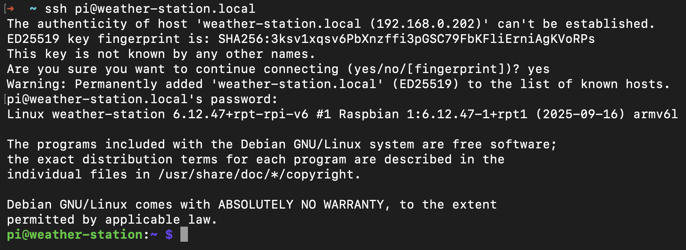

---

## Krok 4 — Konfiguracja Pi (I2C, aktualizacja)

**Cel:** Aktualizacja systemu, włączenie magistrali I2C potrzebnej do komunikacji z czujnikami oraz instalacja niezbędnych narzędzi.

### 4.1 Aktualizacja systemu

Wykonano pełną aktualizację pakietów systemowych:

```bash
sudo apt update && sudo apt upgrade -y
```

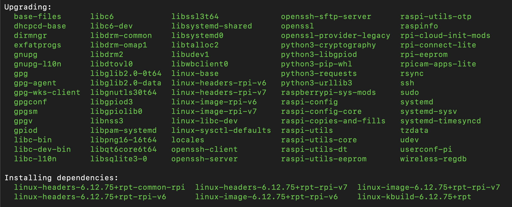

### 4.2 Włączenie interfejsu I2C

Uruchomiono narzędzie konfiguracyjne i włączono I2C:

```bash
sudo raspi-config
```

W menu nawigowano: **Interface Options → I2C → Enable**

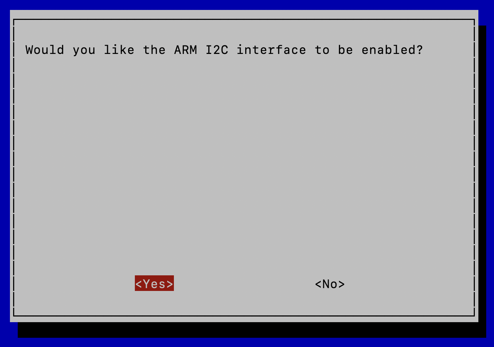

### 4.3 Instalacja narzędzi I2C i bibliotek

Zainstalowano pakiety potrzebne do diagnostyki I2C i komunikacji z czujnikami przez Python:

```bash
sudo apt install -y i2c-tools python3-pip python3-smbus
```

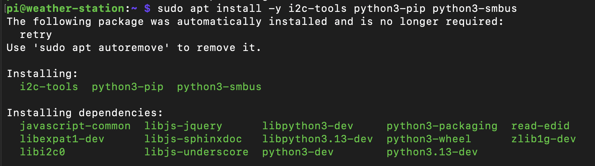

### 4.4 Restart i weryfikacja

Zrestartowano Pi, aby zmiany konfiguracji I2C zostały zastosowane:

```bash
sudo reboot
```

Po ~1 minucie ponownie połączono się przez SSH i zweryfikowano, że moduł I2C jest załadowany:

```bash
ls /dev/i2c*
```

Wyświetlenie `/dev/i2c-1` potwierdza, że interfejs I2C działa poprawnie.

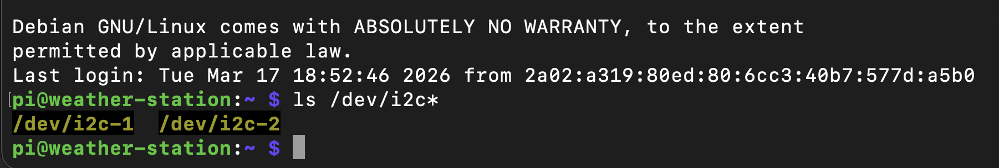

---

## Krok 5 — Testowy skrypt Python (LED + I2C)

**Cel:** Napisanie i uruchomienie prostego programu w Pythonie, który weryfikuje działanie GPIO (miganie wbudowanym LED-em) oraz sprawdza gotowość magistrali I2C do podłączenia czujników.

### 5.1 Przesłanie skryptu na Pi

Skrypt `test_led_i2c.py` przesłano z komputera na Raspberry Pi za pomocą `scp`:

```bash
scp src/test_led_i2c.py pi@weather-station.local:/home/pi/scripts
```

### 5.2 Uruchomienie skryptu

Na Pi uruchomiono skrypt z uprawnieniami root (wymagane do sterowania LED-em ACT):

```bash
cd scripts
sudo python3 test_led_i2c.py
```

Skrypt wykonuje dwa testy:

**Test 1 — Miganie LED-em ACT:**
Program steruje wbudowaną zieloną diodą LED na Raspberry Pi (LED aktywności, GPIO 47) poprzez interfejs sysfs (`/sys/class/leds/ACT/`). LED miga 5 razy z interwałem 0,4 s, po czym przywracany jest domyślny tryb (miganie przy odczycie karty SD).

**Test 2 — Skanowanie magistrali I2C:**
Program wywołuje komendę `i2cdetect -y 1`, która skanuje wszystkie adresy na magistrali I2C-1. Na tym etapie czujniki nie są jeszcze podłączone, więc oczekujemy pustego wyniku — ale sam fakt poprawnego skanu potwierdza, że konfiguracja I2C z Kroku 4 działa prawidłowo.

### 5.3 Wynik działania

Dioda LED migała poprawnie, a skan I2C zakończył się sukcesem (brak urządzeń to oczekiwany wynik na tym etapie). System jest gotowy do podłączenia czujników w następnym kroku.

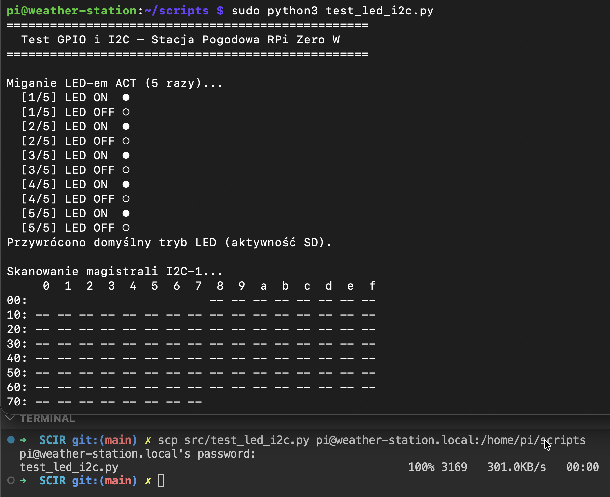

---

## Krok 6 — Podłączenie czujników i weryfikacja I2C

**Cel:** Fizyczne podłączenie czujników BME280 i BH1750 do Raspberry Pi przez magistralę I2C, weryfikacja poprawności połączeń za pomocą `i2cdetect` oraz instalacja bibliotek Python potrzebnych do odczytu danych.

### 6.1 Podłączenie czujników na płytce stykowej

Przed podłączaniem czujników **odłączono zasilanie Raspberry Pi** (odłączenie kabla micro-USB). Czujniki BME280 i BH1750 wpięto w płytkę stykową i połączono z GPIO Raspberry Pi za pomocą kabelków jumper zgodnie ze schematem z rozdziału „Schemat połączeń":

| Pin RPi | Funkcja | Kolor kabelka | Pin BME280 | Pin BH1750 |
|---------|---------|---------------|------------|------------|
| Pin 1 (lewy górny) | 3,3 V | biały | VIN | VCC |
| Pin 6 (prawy, 3. rząd) | GND | czarny | GND | GND |
| Pin 3 (lewy, 2. rząd) | SDA (GPIO 2) | zielony/fioletowy/niebieski | SDA | SDA |
| Pin 5 (lewy, 3. rząd) | SCL (GPIO 3) | żółty/pomarańczowy/czerwony | SCL | SCL |

Oba czujniki są podłączone równolegle do tych samych 4 pinów — rozróżniane są po unikatowych adresach I2C (BME280: `0x76`, BH1750: `0x23`). Rezystory pull-up nie są wymagane, ponieważ moduły mają je wbudowane.


### 6.2 Weryfikacja połączeń — skan I2C

Po podłączeniu zasilania i ponownym połączeniu przez SSH wykonano skanowanie magistrali I2C w celu potwierdzenia, że Pi widzi oba czujniki:

```bash
i2cdetect -y 1
```

W tabeli powinny pojawić się dwa adresy:
- **0x23** — czujnik BH1750 (natężenie światła)
- **0x76** — czujnik BME280 (temperatura, wilgotność, ciśnienie)

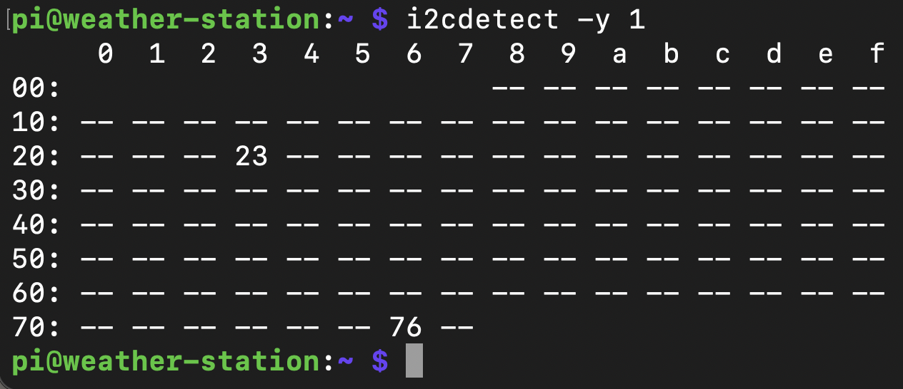

### 6.3 Instalacja bibliotek Python

Raspberry Pi OS Bookworm wymusza użycie wirtualnego środowiska Python (PEP 668) — bezpośrednia instalacja pakietów przez `pip` systemowo jest zablokowana. Utworzono dedykowany katalog projektu z uporządkowaną strukturą folderów, środowiskiem wirtualnym i zainstalowano wymagane biblioteki:

```bash
mkdir -p ~/weather-station/logs
python3 -m venv ~/weather-station/venv
source ~/weather-station/venv/bin/activate
pip install adafruit-circuitpython-bme280 adafruit-circuitpython-bh1750 requests
```

Struktura katalogów na Raspberry Pi:

```
/home/pi/weather-station/
├── venv/              # środowisko wirtualne Python
├── weather_station.py # główny skrypt (krok 7)
├── .env               # klucz API ThingSpeak
└── logs/              # logi działania skryptu
```

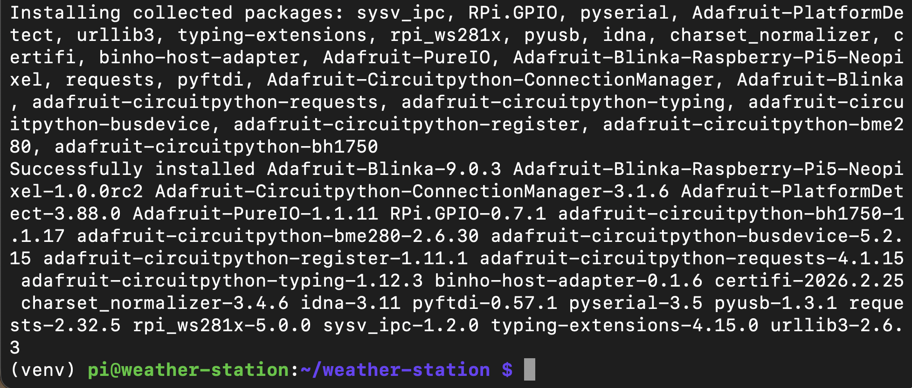

### 6.4 Szybki test odczytu czujników

Aby upewnić się, że biblioteki działają poprawnie i czujniki zwracają sensowne wartości, wykonano szybki test w interpreterze Python (wewnątrz aktywowanego środowiska wirtualnego):

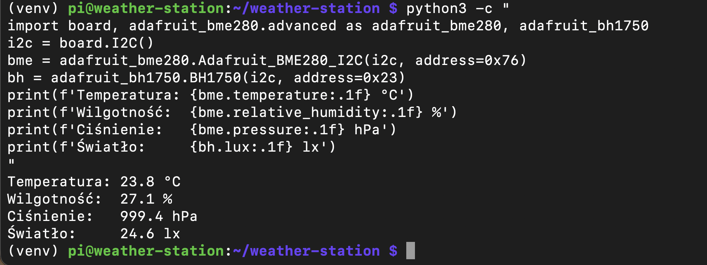

---

## Krok 7 — Skrypt główny stacji pogodowej

**Cel:** Utworzenie skryptu Python, który cyklicznie odczytuje dane z czujników BME280 i BH1750, wysyła je do chmury ThingSpeak oraz loguje lokalnie do pliku.

### 7.1 Utworzenie pliku `.env` z kluczem API

Klucz API ThingSpeak przechowywany jest w pliku `.env` — oddzielonym od kodu źródłowego, aby nie trafił do repozytorium Git:

```bash
echo "THINGSPEAK_API_KEY=..." > ~/weather-station/.env
```

### 7.2 Utworzenie skryptu `weather_station.py`

Skrypt przesłano z komputera na Raspberry Pi za pomocą `scp`:

```bash
scp src/weather_station.py pi@weather-station.local:/home/pi/weather-station/
```

### 7.3 Instalacja dodatkowej zależności

Skrypt korzysta z biblioteki `python-dotenv` do wczytywania pliku `.env`. Zainstalowano ją w środowisku wirtualnym:

```bash
source ~/weather-station/venv/bin/activate
pip install python-dotenv
```

### 7.4 Uruchomienie testowe

Uruchomiono skrypt testowo, aby potwierdzić poprawność odczytów i wysyłki danych do ThingSpeak:

```bash
cd ~/weather-station
source venv/bin/activate
python3 weather_station.py
```

W terminalu pojawiły się komunikaty `OK` z odczytami z czujników, a w ThingSpeak zaczęły pojawiać się pierwsze punkty na wykresach.

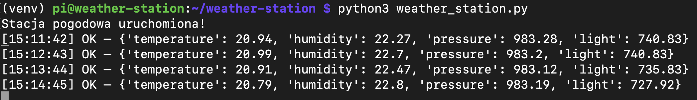

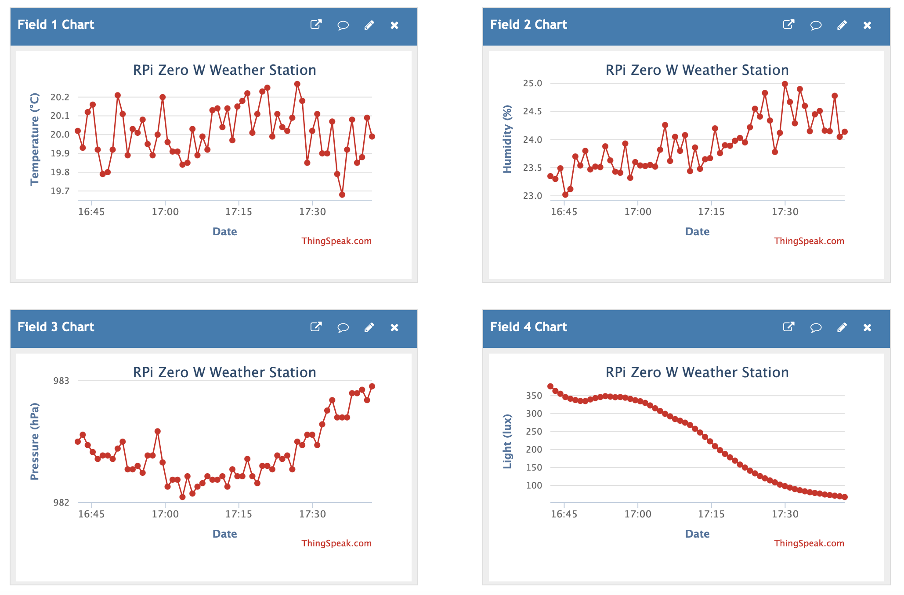

Skrypt zatrzymano kombinacją `Ctrl+C` po potwierdzeniu poprawności działania.

---

## Krok 8 — Usługa systemd (automatyczny start)

**Cel:** Skonfigurowanie stacji pogodowej jako usługi systemowej, dzięki czemu skrypt uruchamia się automatycznie po starcie Raspberry Pi i restartuje się w przypadku awarii.

> **Dlaczego systemd, a nie cron?**
> Skrypt `weather_station.py` działa w pętli nieskończonej (`while True`) — jest demonem, nie zadaniem jednorazowym. `systemd` daje nam: automatyczny restart po awarii (`Restart=on-failure`), centralne logi (`journalctl`), kontrolę zależności (czekanie na sieć) i łatwe zarządzanie (`start`/`stop`/`status`).

### 8.1 Utworzenie pliku usługi

Plik `weather-station.service` umieszczono w repozytorium w katalogu `deploy/`

Kluczowe elementy konfiguracji:

| Dyrektywa | Znaczenie |
|---|---|
| `After=network-online.target` | Czeka na połączenie sieciowe przed startem (wymagane do wysyłki danych do ThingSpeak) |
| `Environment=VIRTUAL_ENV=...` | Ustawia środowisko wirtualne Python bez potrzeby `source activate` |
| `Restart=on-failure` | Automatyczny restart usługi w przypadku nieoczekiwanego zakończenia |
| `RestartSec=30` | Odczekanie 30 sekund przed ponownym uruchomieniem |

### 8.2 Instalacja i aktywacja usługi

Przesłano plik usługi z komputera na Raspberry Pi i aktywowano:

```bash
# Przesłanie pliku usługi na Pi
scp deploy/weather-station.service pi@weather-station.local:/tmp/

# Na Raspberry Pi — instalacja usługi
sudo cp /tmp/weather-station.service /etc/systemd/system/
sudo systemctl daemon-reload
sudo systemctl enable weather-station
sudo systemctl start weather-station
```

Komenda `enable` powoduje, że usługa uruchomi się automatycznie po każdym restarcie systemu.

### 8.3 Weryfikacja działania

Sprawdzono status usługi:

```bash
sudo systemctl status weather-station
```

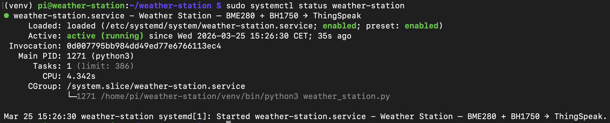

Podgląd logów w czasie rzeczywistym:

```bash
journalctl -u weather-station -f
```

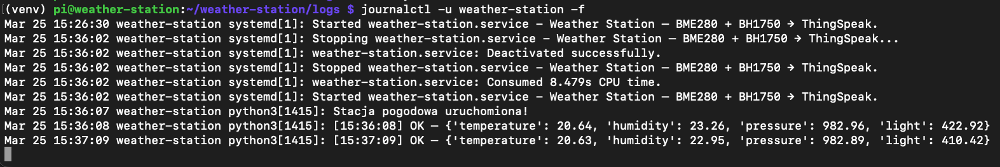

Usługa działa poprawnie — dane są wysyłane do ThingSpeak co 60 sekund, a po restarcie Raspberry Pi skrypt uruchamia się automatycznie.

---

<!-- Dalsze kroki będą uzupełniane w miarę realizacji projektu -->
